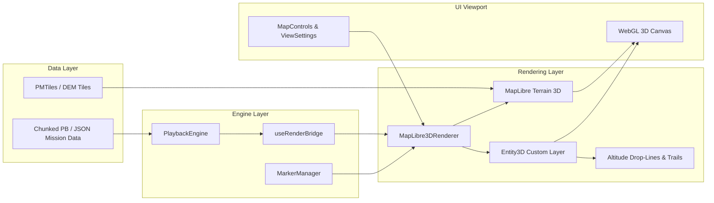

# Requirements

### Overview & Goals
OCAP2-Web currently visualizes Arma 3 mission replays on a 2D Leaflet/MapLibre map. This proposal introduces a full interactive 3D map view utilizing the existing elevation data (DEM / Mapbox terrain-RGB heightmaps) and 3D unit coordinates ($x, y, z$). This allows users to observe terrain topology in true 3D, inspect aircraft and helicopter altitudes above ground level (AGL), trace 3D projectile trajectories, and follow units with a dynamic 3D camera.

### Scope
- **In Scope:**
  - 3D terrain mesh rendering via MapLibre GL JS v5 using `raster-dem` heightmaps (`heightmap.pmtiles`).
  - Seamless in-place toggling between 2D top-down view and 3D perspective without restarting playback.
  - 3D unit positioning at true altitude ($z$ coordinate), with specialized rendering for aircraft (airplanes, helicopters, parachutes).
  - Vertical altitude drop-lines (leader lines to terrain) and flight path ribbons for aerial units.
  - 3D projectile arcs and firelines between shooter and target.
  - 3D camera controls: pitch tilt (0°–85°), 360° bearing rotation, 3D entity follow (orbit/chase camera).
  - UI controls in `MapControls`, `ViewSettings`, and hotkeys for 2D/3D switching and terrain settings.
  - Localization in German, English, and other supported locales.
- **Out of Scope:**
  - Full 3D mesh asset importing for all Arma 3 vehicle models (tactical 2D/3D billboards and procedural geometry are used for optimal performance and consistency).
  - Real-time weather/cloud volumetric simulation.

### User Stories
- **As a spectator/commander**, I want to switch to a 3D perspective to evaluate tactical terrain elevation, line-of-sight advantages, and ridge covers.
- **As a pilot/combat reviewer**, I want to see aircraft and helicopters at their actual flight altitudes with vertical drop-lines down to the ground, so I can immediately gauge altitude above ground level (AGL) and flight maneuvers.
- **As a mission analyst**, I want to follow specific units in 3D chase/orbit view during engagements to understand combat dynamics from their perspective.

### Functional Requirements
- **3D Terrain Rendering:** When a map with heightmap data is loaded (`hasHeightmap: true`), the viewer can render the elevation mesh with configurable exaggeration (0.5x, 1.0x, 1.5x, 2.0x).
- **Fallback for 2D Maps:** Maps without heightmap data will render a flat 3D plane with full 3D camera tilt and aerial unit altitude visualization.
- **Seamless 2D/3D Toggle:** A dedicated 2D/3D button in the bottom-right/top-right controls switches between orthographic top-down and perspective 3D modes smoothly without resetting playback state or time.
- **Altitude Visualization:**
  - Aerial units (planes, helis) float at their calculated elevation ($Z$ coordinate).
  - A subtle vertical projection line (dashed / glowing leader line) connects the aircraft icon to its ground projection on the terrain.
  - An altitude label displays AGL (Above Ground Level) and ASL (Above Sea Level) in the marker tooltip/popup.
  - Flight path trails (ribbons) trace recent flight history in 3D space.
- **3D Camera Navigation:**
  - Mouse right-click / Ctrl + left-click drag adjusts camera pitch (tilt) and bearing (rotation).
  - Scroll wheel zooms in/out along the camera ray.
  - Unit follow mode centers the 3D camera on the target entity with configurable follow distance and angle.

### Non-Functional Requirements
- **Performance & Efficiency:** High framerate (60 FPS) rendering by utilizing GPU hardware acceleration via MapLibre GL JS WebGL context.
- **Minimal Bundle Impact:** Leverages the existing `maplibre-gl: ^5.24.0` already bundled in the frontend dependencies, avoiding redundant 3D engine overhead.
- **State Consistency:** Zero desynchronization between playback timeline, event logs, unit list, and the 3D viewport.

# Technical Design

### Current Implementation
- **Backend Elevation Pipeline:** `internal/maptool/heightmap.go` processes DEM grids into Mapbox terrain-RGB `heightmap.pmtiles`. `internal/maptool/styles.go` already defines the `heightmap` source as `type: "raster-dem"`.
- **Playback Data Structures:** Protobuf (`pkg/schemas/protobuf/v1/ocap.proto`) and JSON decoders (`jsonDecoder.ts`, `protobufDecoder.ts`) decode 3D positions `[posX, posY, posZ]` into `ArmaCoord` (`[number, number, number]`).
- **Frontend Architecture:** `LeafletRenderer` (`ui/src/renderers/leaflet/leafletRenderer.ts`) currently hosts map rendering via Leaflet with MapLibre vector tiles rendered in a 2D Leaflet pane. `useRenderBridge.ts` feeds per-frame entity snapshots from `PlaybackEngine` to the active `MapRenderer`.

### Key Decisions
1. **Rendering Engine: MapLibre GL JS Native 3D Terrain**
   - *Decision:* Utilize MapLibre GL v5's native `terrain` engine (`raster-dem`) rather than an isolated external 3D framework.
   - *Rationale:* Maximizes performance, leverages already-built PMTiles pipelines, avoids multi-megabyte bundle bloat, and provides seamless tile streaming for large Arma 3 terrains (Altis, Stratis, etc.).
2. **Altitude & Aircraft Representation: 3D Billboards with Ground Projections**
   - *Decision:* Render elevated units as camera-facing tactical billboards with vertical ground projection lines and dynamic flight path ribbons.
   - *Rationale:* Maximizes readability and situational awareness without cluttering the screen or requiring heavy 3D asset downloads.
3. **Seamless Dual-Mode Controller:**
   - *Decision:* Integrate 2D and 3D modes under a unified renderer interface (`MapRenderer` / `MapLibre3DRenderer`) sharing the same playback state signals.
   - *Rationale:* Eliminates reload delays and memory churn when switching views during playback.

### Architecture Diagram


### Proposed Changes

#### 1. Backend (`internal/maptool/`):
- Extend `GenerateStyleDocument()` in `internal/maptool/styles.go` to include the `terrain` specification:
  ```go
  if cfg.HasHeightmap {
      doc["terrain"] = map[string]interface{}{
          "source": "heightmap",
          "exaggeration": 1.0,
      }
  }
  ```
- Ensure `hasHeightmap` boolean is consistently saved to `map.json` in `internal/maptool/metadata.go`.

#### 2. Frontend Core & Types (`ui/src/`):
- Extend `WorldConfig` in `ui/src/data/types.ts`:
  ```typescript
  export interface WorldConfig {
    // ... existing fields
    hasHeightmap?: boolean;
    terrainExaggeration?: number;
  }
  ```
- Extend `MapRenderer` in `ui/src/renderers/renderer.interface.ts`:
  ```typescript
  export interface MapRenderer {
    // ... existing methods
    is3DMode(): boolean;
    set3DMode(enabled: boolean): void;
    getPitch(): number;
    setPitch(pitch: number): void;
    getBearing(): number;
    setBearing(bearing: number): void;
    setTerrainExaggeration(exaggeration: number): void;
  }
  ```

#### 3. 3D Map Renderer (`ui/src/renderers/maplibre/`):
- Implement `MapLibre3DRenderer` in `ui/src/renderers/maplibre/maplibre3dRenderer.ts`:
  - Mounts native `maplibregl.Map` with pitch (0° to 85°) and bearing rotation.
  - Loads PMTiles protocols and styles with terrain enabled.
  - Implements a custom WebGL / MapLibre `CustomLayerInterface` for 3D marker billboards, vertical altitude leader lines, and projectile trajectory ribbons.
  - Dynamically calculates terrain elevation at $(x, y)$ to compute true altitude above ground level (AGL = $Z_{unit} - Z_{terrain}$).

#### 4. UI Components (`ui/src/pages/recording-playback/`):
- `MapControls.tsx`:
  - Add 2D/3D toggle button with smooth camera animation.
  - Add 3D compass ring (click to reset bearing to North) and pitch slider.
- `ViewSettings.tsx`:
  - Add toggles for `3D Terrain`, `Elevation Drop Lines`, `Flight Trails`, and `Terrain Exaggeration` selector (0.5x, 1x, 1.5x, 2x).
- `TopBar.tsx` & `FollowIndicator.tsx`:
  - Enhance follow camera indicator to reflect 3D chase/orbit tracking.

### File Structure Changes
```
internal/maptool/
├── styles.go                   (modified: add terrain root property to styles)
└── metadata.go                 (modified: expose hasHeightmap)

ui/src/
├── data/
│   └── types.ts                (modified: add hasHeightmap to WorldConfig)
├── renderers/
│   ├── renderer.interface.ts   (modified: 3D camera & mode signatures)
│   └── maplibre/
│       ├── maplibre3dRenderer.ts   (new: full 3D terrain & marker renderer)
│       ├── entity3dLayer.ts        (new: WebGL custom layer for elevated markers, drop-lines, trails)
│       └── __tests__/
│           └── maplibre3dRenderer.test.ts (new: renderer tests)
├── pages/recording-playback/
│   ├── components/
│   │   ├── MapControls.tsx     (modified: 2D/3D toggle & pitch controls)
│   │   ├── ViewSettings.tsx    (modified: 3D layer & exaggeration toggles)
│   │   └── MapContainer.tsx    (modified: dual-mode renderer container)
│   ├── shortcuts.ts            (modified: add 3D shortcut keys)
│   └── useRenderBridge.ts      (modified: pass 3D coords to renderer)
└── i18n/
    └── locales.ts              (modified: 3D localization strings)
```

# Testing

### Validation Approach
Automated and visual test coverage across backend metadata generation, frontend renderer lifecycle, 3D coordinate conversion, and UI state synchronization.

### Key Scenarios
- **Terrain Loading & 3D Initialization:**
  - Verify that maps with `heightmap.pmtiles` initialize with 3D terrain active and camera pitch enabled.
  - Verify that maps without heightmaps gracefully fall back to a flat 3D plane with functioning pitch/bearing controls and elevated aircraft markers.
- **2D / 3D Seamless Switching:**
  - Verify toggling from 2D to 3D smoothly animates camera pitch from 0° to 60° while maintaining current map center and playback position.
  - Verify toggling from 3D back to 2D resets camera pitch to 0° and bearing to 0° (North) without interrupting playback audio or timeline scrubbing.
- **Aerial Unit & Aircraft Altitude:**
  - Verify that aircraft with $Z > 0$ render at their elevated 3D position above the terrain surface.
  - Verify that vertical drop-lines connect the aircraft marker to the exact terrain surface coordinate directly below it.
  - Verify that flight path ribbons accurately follow aircraft historical positions.
- **3D Camera Interaction & Entity Follow:**
  - Verify right-click / Ctrl-drag updates camera pitch and bearing.
  - Verify following a moving unit in 3D tracks the unit smoothly in 3D space.

### Edge Cases
- **Sub-zero / Underground Coordinates:** Clamp or render water/sub-surface units appropriately without clipping through terrain geometry.
- **Rapid 2D/3D Toggling:** Ensure WebGL contexts and animation frames are properly cleaned up and do not leak memory during fast toggle operations.
- **Zero-Altitude Units:** Ground vehicles and infantry ($Z \approx 0$) stick to the terrain surface without floating or sinking into the mesh.

### Test Changes
- **Backend Tests:** Add unit tests in `internal/maptool/styles_test.go` verifying the presence and format of `terrain` in generated style documents.
- **Frontend Renderer Tests:** Add test suites in `ui/src/renderers/maplibre/__tests__/maplibre3dRenderer.test.ts` for camera methods, marker lifecycle, and layer toggles.
- **UI Tests:** Update `ui/src/pages/recording-playback/__tests__/MapControls.test.tsx` and `ViewSettings.test.tsx` for the new 2D/3D buttons and settings.

# Delivery Steps

### ✓ Step 1: Backend terrain configuration and data model extensions
The backend style and metadata pipeline exports 3D terrain sources and the frontend data models expose heightmap capabilities.

- Update `internal/maptool/styles.go` to add a `terrain` configuration section (`source: "heightmap"`, `exaggeration: 1.0`) to MapLibre style document generators when `cfg.HasHeightmap` is true.
- Extend `WorldConfig` in `ui/src/data/types.ts` with `hasHeightmap?: boolean` and terrain settings.
- Update `internal/maptool/metadata.go` and `internal/maptool/scanner.go` to ensure `hasHeightmap` is consistently exposed in `map.json` and API endpoints.
- Add unit tests in `internal/maptool/styles_test.go` and `ui/src/data/__tests__/apiClient.test.ts` verifying terrain source injection and metadata parsing.

### ✓ Step 2: MapLibre 3D terrain renderer implementation
A dedicated MapLibre 3D renderer is created implementing the `MapRenderer` interface with 3D terrain and pitch/bearing camera controls.

- Implement `MapLibre3DRenderer` in `ui/src/renderers/maplibre/maplibre3dRenderer.ts` conforming to `MapRenderer`.
- Initialize MapLibre GL map instance with terrain enabled (`map.setTerrain({ source: 'heightmap', exaggeration: 1.0 })`) and sky/atmosphere layer for immersive depth.
- Implement camera controls for pitch (0° to 85°), bearing rotation (0° to 360°), and smooth transition between top-down 2D orthographic perspective and tilted 3D perspective.
- Implement unit and briefing marker rendering on the 3D surface using MapLibre Symbol and GeoJSON layers.
- Add unit tests in `ui/src/renderers/maplibre/__tests__/maplibre3dRenderer.test.ts` covering lifecycle, camera manipulation, and terrain enabling.

Notes on scope actually delivered:
- Entity + briefing markers (ICON/ELLIPSE/RECTANGLE/POLYLINE) render via batched GeoJSON sources, flushed once per animation frame instead of per-entity `setData()` calls.
- Briefing marker pattern/brush textures (stripe/grid fills from `svgPatterns.ts`) were **not** ported — polygons render as solid semi-transparent fills only.
- The "grid" overlay layer is tracked in the visibility signal but has no visual implementation yet in 3D.
- Selectable today via `?renderer=3d` in the URL (alongside the existing `?renderer=dom`); not yet wired into a persistent user setting.
- `init()`/camera/GeoJSON-source code paths that need a real WebGL context are excluded from unit-test coverage, same as `leafletRenderer.ts` — only pure helpers (coordinate conversion, pitch clamping, icon key resolution) are unit tested. Manual verification is via the running app.

### * Step 3: 3D unit elevation, drop-lines, and aerial flight trails
Aircraft and high-altitude units are rendered in 3D with elevation drop-lines, flight trails, and 3D orientation.

- [x] Implement `Entity3DLayer` for rendering elevated units (heli/plane/parachute) with true Z altitude.
- [x] Render vertical projection/drop-lines (leader lines) from aircraft down to terrain ground level (AGL visualization), plus a small altitude readout.
- [ ] Implement dynamic 3D flight path ribbons/trails behind aircraft and fast-moving aerial units during playback.
- [ ] Render 3D projectile trajectories and ballistic arcs between shooter and impact point using 3D coordinates from `FiredFrame` and `HitKilledEvent` (fire lines currently still render flat, via the existing 2D `addLine()` path).
- [ ] Update `useRenderBridge.ts` to supply 3D coordinate snapshots and fireline vectors directly to the 3D layer (not needed yet — `updateEntityMarker()` already carries the full `[x,y,z]` position, which is all `Entity3DLayer` currently needs).
- [x] Add unit tests for the 3D projection math (`transformPoint`, `lngLatAltToMercator`) and a lifecycle smoke test; visual/positioning correctness verified manually in the running app (jsdom has no real canvas/WebGL context).

Implementation notes:
- `entity3dLayer.ts` draws into a plain 2D canvas overlay (not raw WebGL) — it projects each entity's 3D world position to screen space every frame using the `modelViewProjectionMatrix` MapLibre's `CustomLayerInterface.render()` hands it (via hand-rolled Web Mercator + matrix math, not a runtime import of `maplibregl.MercatorCoordinate`, to avoid a circular import with `maplibre3dRenderer.ts`), then draws ordinary `` marker icons. This reuses the same server-generated marker images as the ground layer without needing shaders/texture atlases for a modest entity count — a deliberate simplification over a full WebGL billboard renderer, revisit if entity counts or perf ever demand it.
- Altitude is rendered as true meters above the world's zero-elevation datum (not AGL relative to terrain) — with a real heightmap this means aircraft correctly poke through/clear hills relative to sea level; there's no per-point terrain-height sampling yet to compute true AGL.
- Ground vehicles/infantry are unaffected — they still drape flat onto the terrain surface via the GeoJSON symbol layer, which is the correct behavior for them (self-corrects to actual mesh height).

###   Step 4: UI controls, 2D/3D toggle, and camera follow modes
Users can seamlessly switch between 2D and 3D view modes with dedicated camera controls and tactical layer toggles.

Partially started ahead of schedule while building Step 2: `MapControls.tsx` now shows a 2D/3D toggle button (gated on `renderer.getControls().supports3D`) that calls `renderer.set3DMode()`, and an `toggle_3d` i18n key was added for all 8 locales. Still open: keyboard shortcut, pitch slider/compass reset/exaggeration controls, `ViewSettings.tsx` toggles, and — the bigger item — **true seamless hot-swap between the 2D Leaflet renderer and `MapLibre3DRenderer` is not implemented**. Today the renderer is chosen once at page load via the `?renderer=` URL param (`dom` | `3d` | default canvas); switching requires a page reload. Making this seamless means either re-parenting `PlaybackEngine`/`MarkerManager` onto a freshly-`init()`'d renderer while preserving playback position, or running both renderers concurrently and cross-fading — worth a design discussion before implementing.

- Add a 2D/3D mode switch button to `MapControls.tsx` and keyboard shortcut (`3` / `T`) in `shortcuts.ts`.
- Add 3D-specific controls in `MapControls.tsx` (pitch slider/buttons, compass bearing reset, terrain exaggeration toggle).
- Extend `ViewSettings.tsx` with toggles for 3D terrain, elevation drop-lines, flight trails, and 3D buildings.
- Update `RecordingPlayback.tsx` and `useRenderer.tsx` to handle seamless renderer hot-swapping or dual-mode synchronization without reloading mission data.
- Update `engine.ts` entity tracking to support 3D chase and orbit camera follow modes for selected units.
- Add i18n translation keys in `ui/src/i18n/locales.ts` (DE, EN, etc.) for all new 3D controls and settings.
- Add UI integration tests in `ui/src/pages/recording-playback/__tests__/MapControls.test.tsx` and `ViewSettings.test.tsx`.